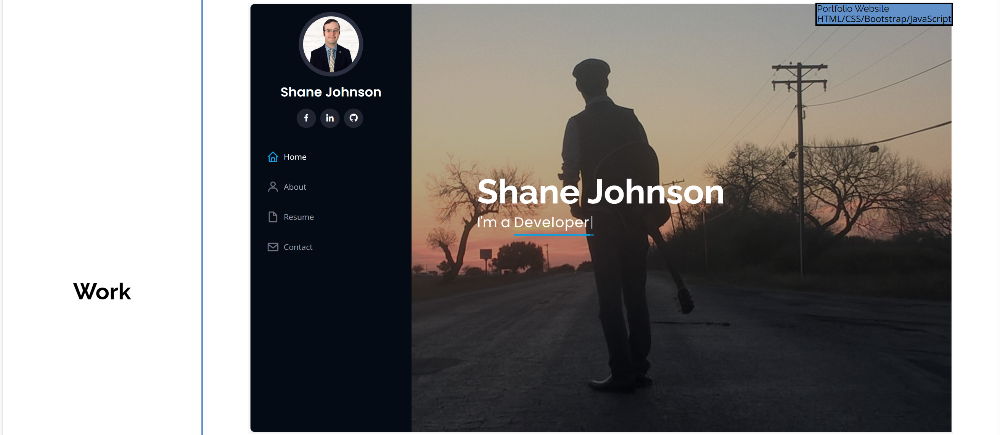
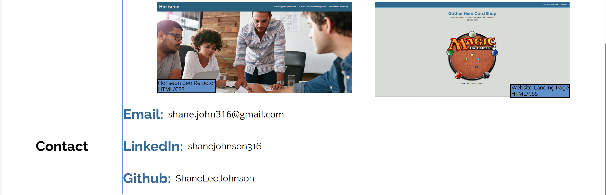

# Shane-Johnson-Professional-Portfolio

## Description

This website is a professional portfolio with info about me and my career goals as well as a section showcasing some of the projects that I've completed. At the bottom of the website is a section with different methods to get in touch with me.

## Installation

N/A

## Usage

To see the website in action you can click on this link: https://shaneleejohnson.github.io/Shane-Johnson-Professional-Portfolio/

To use this portfolio you can click on any of the nav links to be taken directly to the corresponding section. There is a section called work that contains some of my completed projects. You can click on the image of a project your interested in to be taken to that deployed application. There is also a contact section that you can use to navigate to my github or linkedin to see more about me and the work that I've done.

## Credits

Code to reset the default browser settings: http://meyerweb.com/eric/tools/css/reset/ v2.0 | 20110126 License: none (public domain)

## License

Please refer to the LICENSE in the repo.